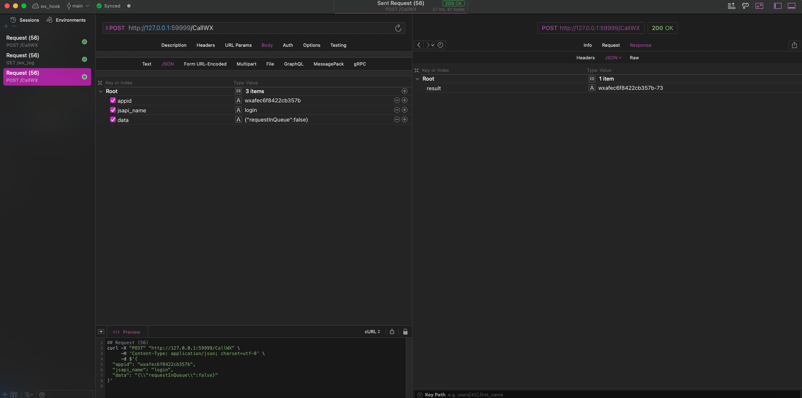
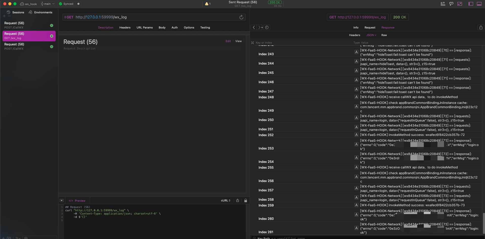
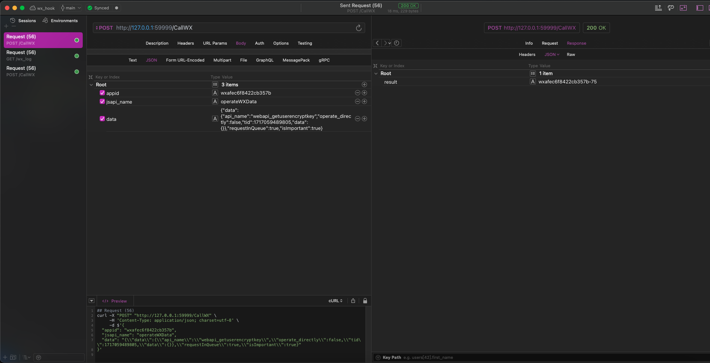
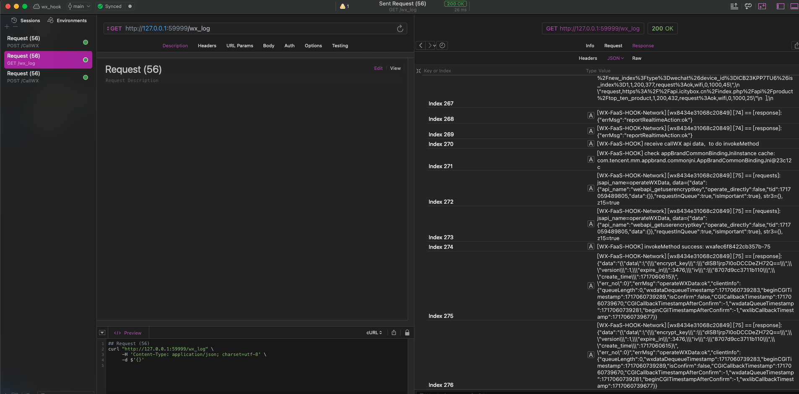

# Hook_WeChat_FaaS_Xposed

[Hook_WeChat_FaaS](https://github.com/FourTwooo/Hook_WeChat_FaaS)的Xposed版本

## 用法

1. 自编译or下载release中的apk文件
2. 安装到有LSPosed的设备上，作用域勾选微信
3. 打开微信，进入任意一个小程序
4. 访问Xposed插件暴露的API接口，执行云函数和获取日志
   

## API接口

| 接口名 | 参数 | 返回值 | 说明 |
| :---: | :---: | :---: | :---: |
| GET / | 无 | ok |  用于测试Xposed Server是否开启 |
| POST /CallWX | {"appid": "wxafec6f8422cb357b","jsapi_name": "login","data": "{\\"requestInQueue\\":false}"} | {"result": "wxafec6f8422cb357b-86"} | 调用云函数，返回请求序列号 |
| GET /wx_log | 无 | ["[WX-FaaS-HOOK] Find app: com.tencent.mm","[WX-FaaS-HOOK] start embeddedServer at 0.0.0.0:59999",...] | 查询近1500条日志|

## 注意事项
1. 第一次打开小程序执行自定义云函数后有可能会出现只有request但没有response的情况，需要划掉小程序重新打开，再执行一次自定义云函数
2. 必须进入到小程序页面才能打开Xposed Server，退出小程序后Xposed Server也会关闭
3. 本版本未经过充分测试，请勿在生产环境使用

## 效果图
wx.login请求和响应

UserCryptoManager.getLatestUserKey请求和响应

## 致谢
[Hook_WeChat_FaaS](https://github.com/FourTwooo/Hook_WeChat_FaaS)